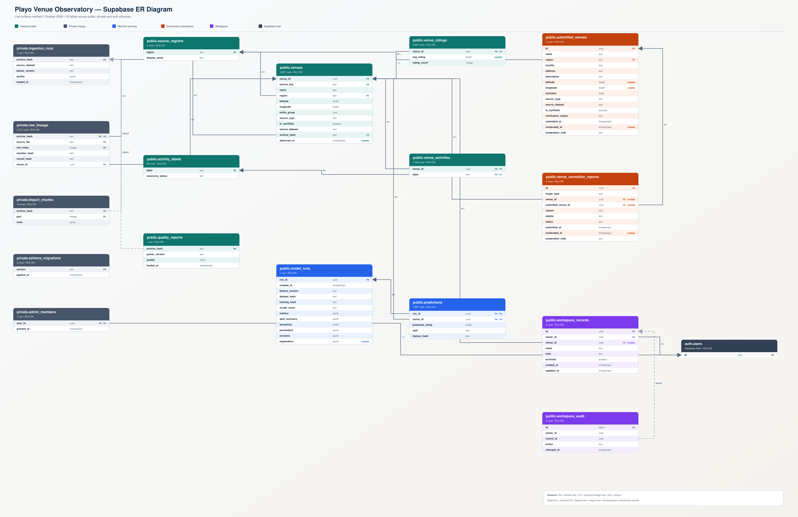

# Implemented database design

The diagram above was regenerated from the live Supabase schema and presentation-safe artwork was verified on 2 October 2026. Solid connectors are enforced foreign keys; dashed connectors are intentional logical links without a database FK constraint. A scalable version is available at [`docs/assets/playo-supabase-er-diagram.svg`](assets/playo-supabase-er-diagram.svg).

All historical records are protected from application writes. The schema was most recently verified through the Supabase integration on 2 October 2026.

| Object | Grain / constraints | Access |
|---|---|---|
| source_regions | Region key; display name | Public SELECT |
| venues | UUID PK, unique stable source key, region FK, valid coordinate bounds, historical-only provenance, unknown date remains NULL | Public SELECT |
| venue_ratings | Venue PK/FK; 1–5 rating or NULL; nonnegative integer count; count-zero iff NULL target | Public SELECT |
| activity_labels | Label PK; unclassified activity/service terminology | Public SELECT |
| venue_activities | Venue/label composite PK and FKs | Public SELECT |
| model_runs | Run UUID; metrics, split, sensitivity, parameters and versions JSONB; feature/dataset/training hashes | Public SELECT |
| predictions | Run/venue composite PK/FKs; 1–5 prediction; train/test/unrated check; feature hash | Public SELECT |
| workspace_records | UUID; auth owner FK; optional venue FK; constrained name/note; archive flag; timestamps | Admin AND owner CRUD |
| workspace_audit | Event ID; owner/record IDs retained even after workspace deletion; trigger-generated action and timestamp | Admin AND owner SELECT |
| quality_reports | Archive hash PK; aggregate quality JSONB, parser version and load time | Public SELECT; ingestion trigger writes |
| private.ingestion_runs | Archive hash PK, parser and aggregate quality evidence | Database owner |
| private.raw_lineage | Archive/file/row composite PK; venue FK; member/record hashes | Database owner |
| private.import_chunks | Archive/part composite PK; sanitized staging JSONB | Database owner |
| private.schema_migrations | Original application migration ledger | Database owner |
| private.admin_members | Auth user PK/FK; grant time | Database owner writes; authenticated user sees only own membership |

Public views `feature_store_v1`, `dataset_status`, `region_statistics`, `region_directory`, `activity_statistics`, `venue_catalog` and `activity_directory` use security invoker. Public RPCs, including `venue_catalog_search`, are also security invoker. `venue_catalog` combines historical rows with approved community rows only; pending/rejected rows and moderation notes are excluded. `activity_directory` keeps historical rating statistics separate while adding approved-community and combined discovery counts. `quality_summary` was changed from security definer to invoker; a trigger refreshes its public aggregate report. Private triggers use locked search paths and fixed table targets.

Aggregate-only functions `lineage_summary`, `quality_drilldown` and `model_diagnostics` expose reproducibility and evaluation evidence without exposing private raw rows. Moderation triggers stamp `moderated_at` on decisions and reject a rejection without an explanatory note. Partial indexes support pending/approved moderation queues and split-based prediction inspection.

The restrictive `approved_admin` policy combines with ownership policies, preventing signup-based privilege escalation. Membership is not taken from editable user metadata. Historical tables have SELECT-only grants, with no INSERT/UPDATE/DELETE policies for public/application roles.

Indexes cover region, activity/venue junction, archive, prediction venue FK, workspace owner/update time and venue FK, audit owner/time and private lineage venue FK. The existing lower-name pattern index does not accelerate leading-wildcard ILIKE; at this dataset size measured search remained small (one sampled RPC: 17.874 ms). No claim of measured index speedup is made. A trigram extension is not needed for the current volume.

## Migration history
Original changes were applied through the owner SQL interface and recorded in private.schema_migrations (001, 003, 002). Additions are recorded both there and in native Supabase migration history. Never use `db reset` against this project. Native migration history alone does not represent the original baseline.
