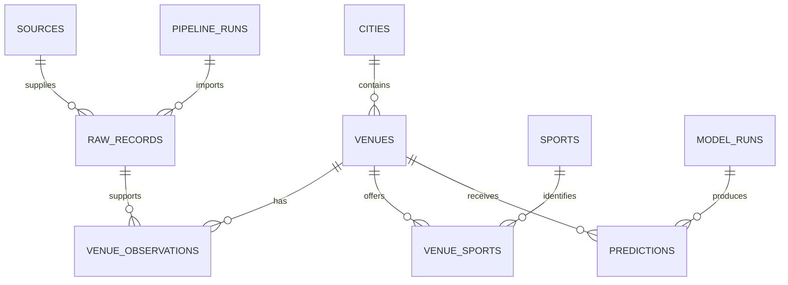

# Provisional database design

**No migrations applied.** This design follows observed field categories and the professor's relational/JSONB examples; finalize only after permitted data profiling.

| Proposed object | Grain/key | Purpose and constraints |
|---|---|---|
| staging.sources | one documented source | source type and permission/licence reference; private |
| staging.pipeline_runs | one execution | status, timestamps, parser version, reconciled counts |
| staging.raw_records | one raw observation | run/source FKs, JSONB payload, raw hash and original-file pointer |
| staging.quality_issues | one detected issue | raw record FK, rule, severity, reason; private |
| core.cities | one canonical city | country/state/city composite identity to avoid ambiguous names |
| core.venues | one venue per provenance namespace | source key unique within source; city FK, archival state |
| core.venue_observations | one venue at observed time | venue/raw FKs; rating 0–5 or NULL; count >=0 or NULL |
| core.sports / core.amenities | one canonical label | unique normalized key, original labels retained separately |
| core.venue_sports / core.venue_amenities | one entity pair | composite PKs and FKs prevent repeated joins |
| core.venue_timings | one verified schedule interval | nullable structured intervals plus untouched timing text |
| analytics.venue_features | one versioned venue/snapshot | source separation, features, target, split membership |
| analytics.model_runs | one fit/evaluation | model version, training hash, parameters, metrics, sample counts |
| analytics.predictions | one model + venue + feature snapshot | unique composite key; timestamps and stale marker |
| private.admin_members / private.audit_events | one admin / one action | server-controlled membership, protected mutation trace |

Entity identity must not depend solely on venue name. Stable provider keys take priority. Fuzzy matches become review candidates rather than silent merges. Synthetic identities stay in their own namespace. Capture time is not venue age or transaction time.

Normalization: sports/amenities use junction tables; ratings are observations, not repeated static columns; raw variable metadata stays JSONB. Build aggregate views for the UI without denormalizing source evidence. Use UTC timestamps with original local timing text preserved.

## Planned relationship diagram

## Migration acceptance

Run on an isolated test database/schema first, then verify FKs, unique keys, numeric checks, NULL behavior, rollback, role-based denial and intentional safe reads. Record migration checksums. Do not run DROP/TRUNCATE examples against production. Benchmark selected queries before/after appropriate indexes; a sequential scan can be correct for a small table.
