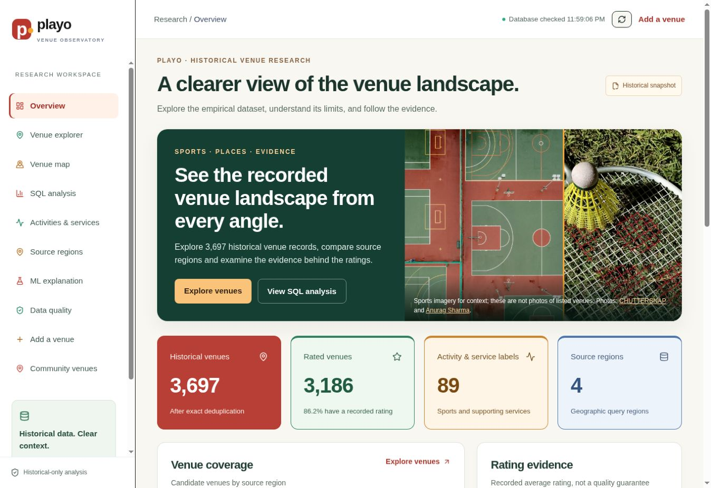
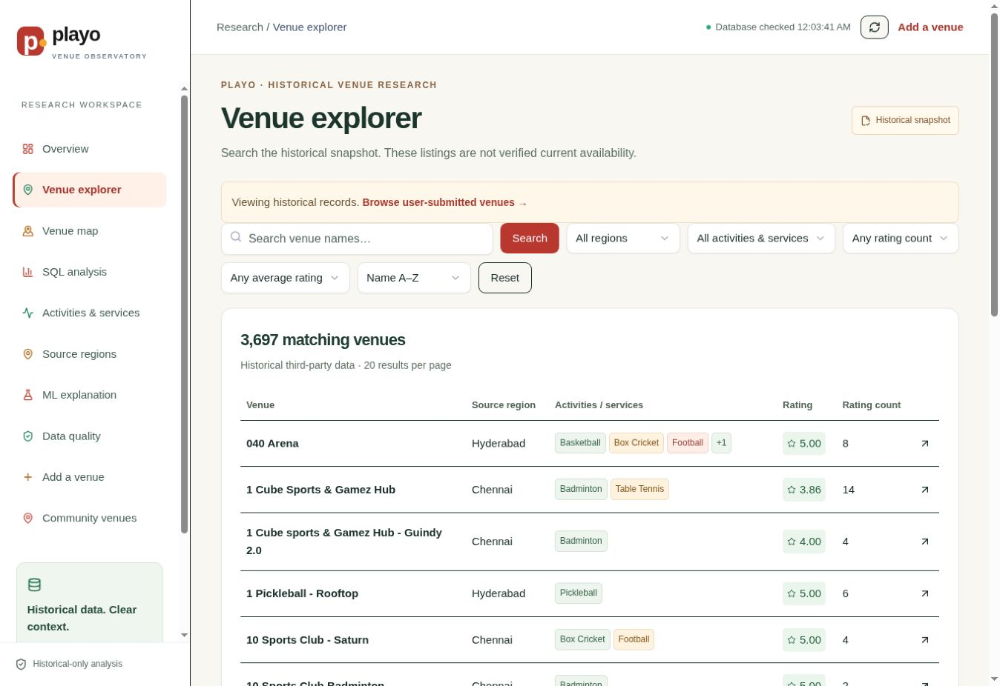
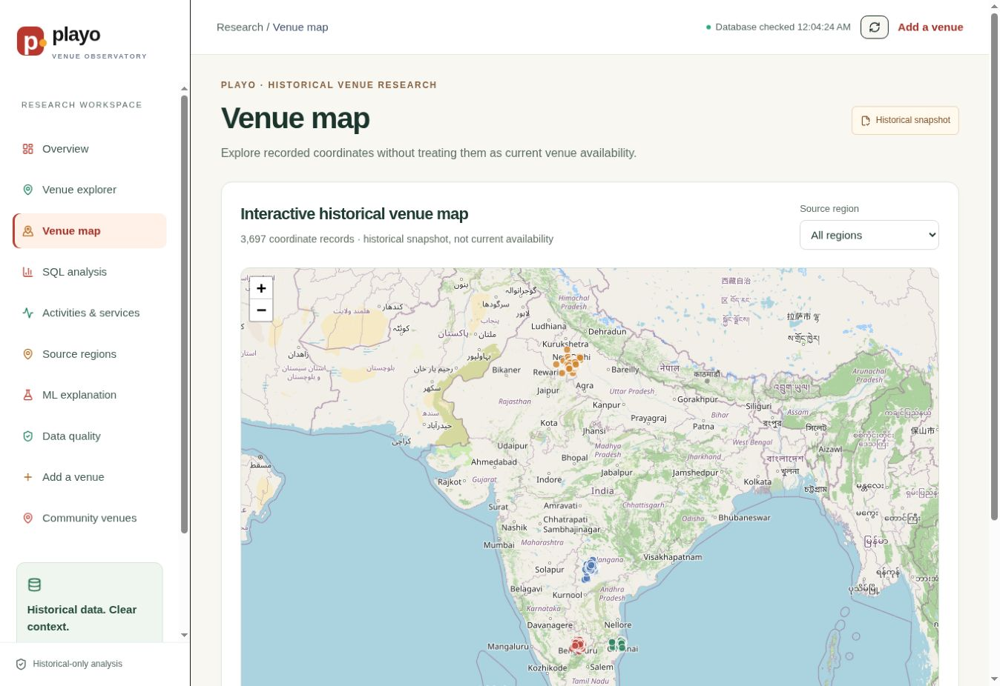
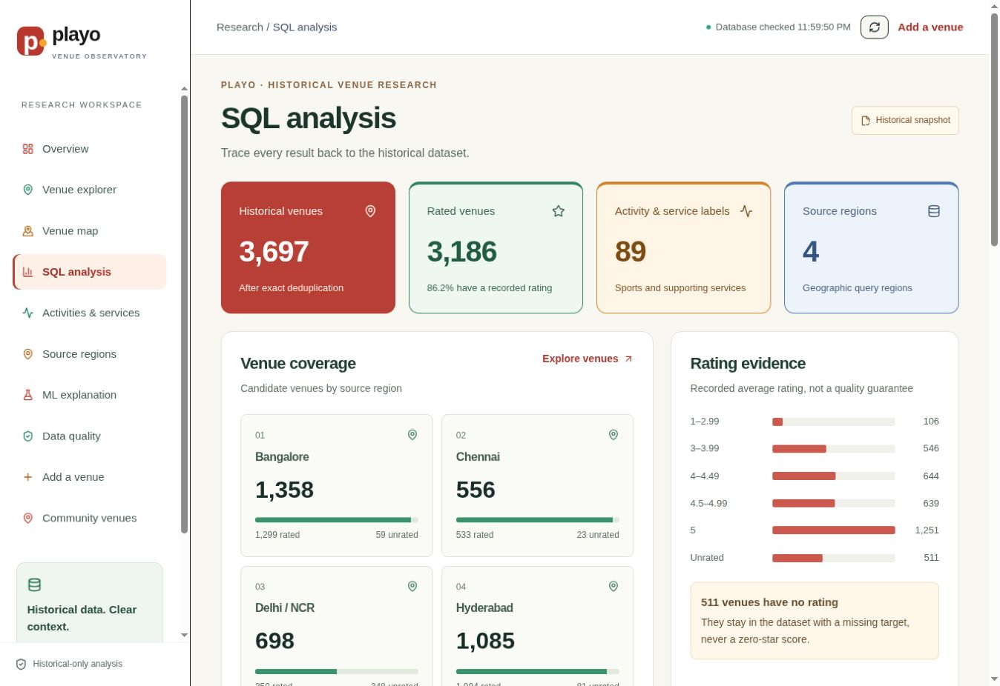
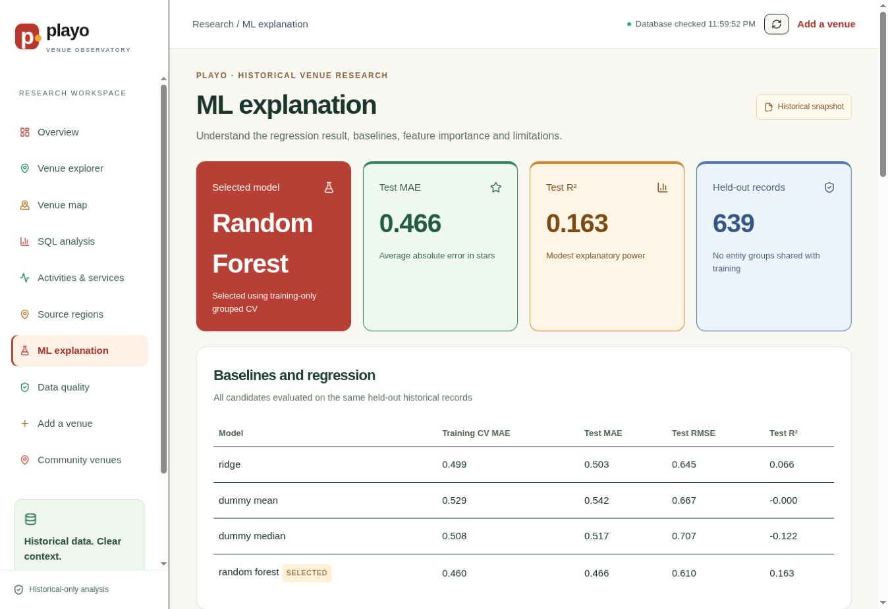
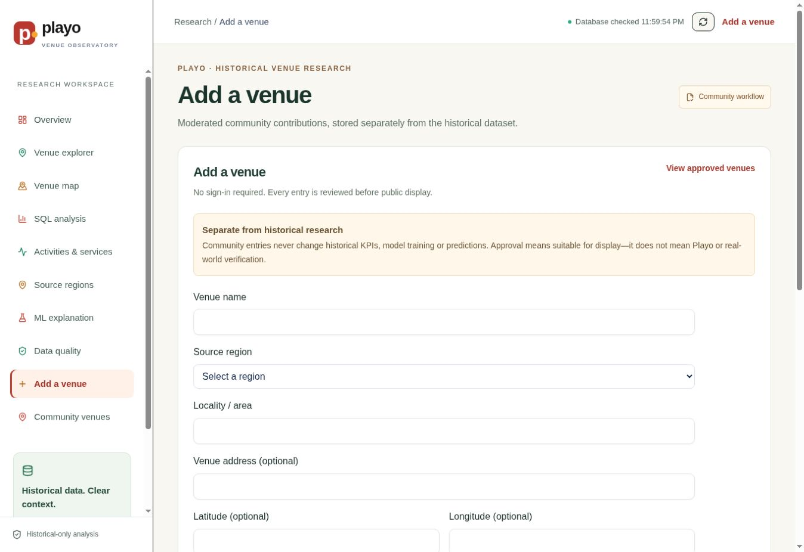
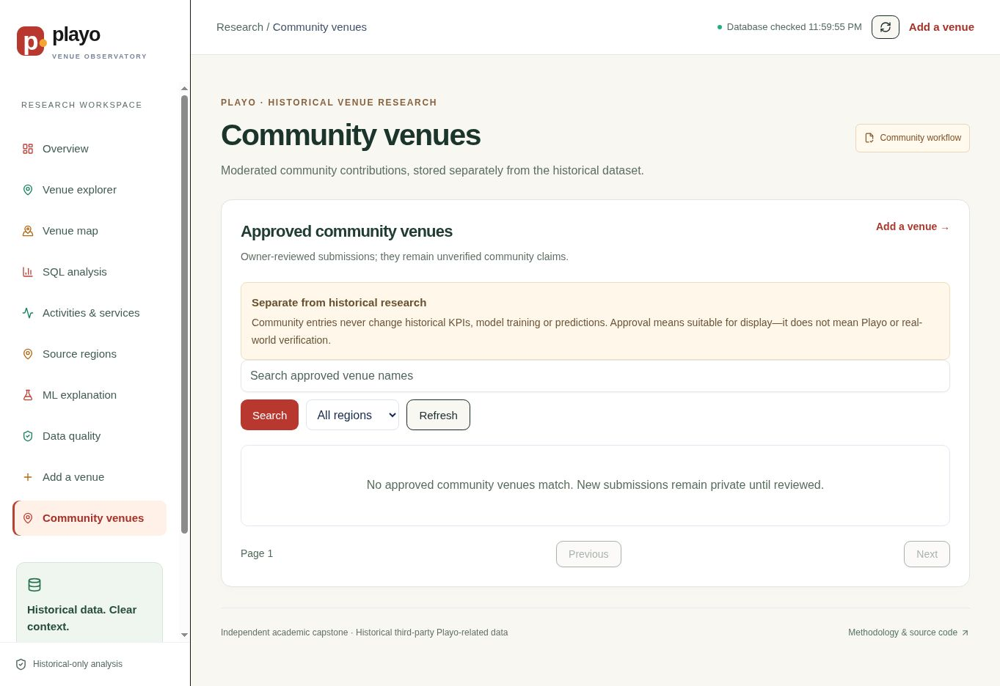
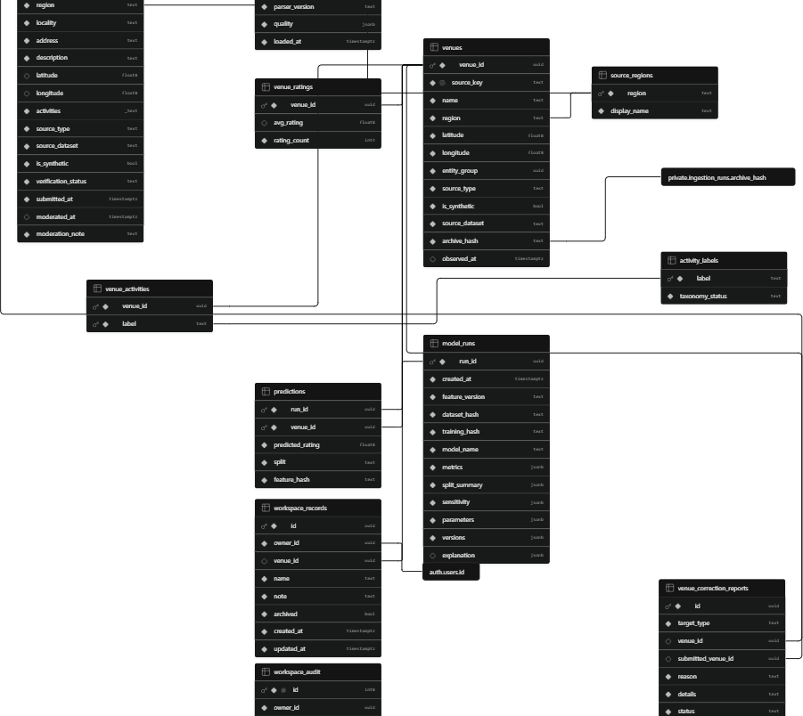

# Playo BDM teammate quick guide

This page is the short companion to the full [Word guide](../deliverables/Playo_BDM_Capstone_Teammate_Guide.docx), [PDF guide](../deliverables/Playo_BDM_Capstone_Teammate_Guide.pdf) and [team presentation](../deliverables/Playo_BDM_Capstone_Team_Presentation.pptx).

## What the project is

The Playo Venue Observatory is an academic Business Data Management project. It turns a historical third-party Playo-related export into a traceable analytics system:

1. Preserve the private raw archive unchanged.
2. Audit and clean the historical records in Python.
3. Load normalized, provenance-aware tables into Supabase PostgreSQL.
4. Perform SQL EDA and build a leakage-safe feature view.
5. Compare simple baselines with a grouped random-forest regression.
6. Write versioned predictions back to PostgreSQL.
7. Display live database results in a React dashboard on Cloudflare Workers.

The current Playo website was used only as a domain/schema reference. It was not scraped. The project does not claim current availability, bookings, demand, revenue or price.

## Key numbers to remember

| Item | Result |
|---|---:|
| Raw rows | 3,701 |
| Exact-deduplicated historical rows | 3,697 |
| Rated / unrated | 3,186 / 511 |
| Source regions | 4 |
| Activity and service labels | 89 |
| Held-out MAE / RMSE / R² | 0.4655 / 0.6102 / 0.1633 |
| Persisted predictions | 3,697 |
| Synthetic historical rows | 0 |

## Walk through the website

Open [the live dashboard](https://playo-venue-observatory.dhivaa2004.workers.dev). No sign-in is required.

### 1. Read the overview

Click **Overview** in the left sidebar. Confirm the headline counts and read the historical-data warning.

### 2. Explore individual venues

Click **Venue explorer**. Use the search box and filters, then open a venue card for its historical details. Filters and page state are stored in the URL.

### 3. Inspect geography

Click **Venue map**. Choose a source region and inspect the plotted historical coordinates. A source region is a query label, not a verified municipal boundary.

### 4. Explain the SQL analysis

Click **SQL analysis**. Use the cards and charts to discuss regional coverage, ratings and activity/service counts. These values are database aggregates, not hard-coded numbers.

### 5. Explain the model honestly

Click **Rating estimation**. Start with the median baseline, then compare the random forest on the held-out entity groups. The modest R² is a limitation, not a failure to hide.

### 6. Submit a community venue

Click **Add a venue**, complete the required fields, solve Turnstile and submit. The row is written to Supabase as `pending`; it does not enter historical KPIs or ML.

### 7. Understand moderation

The database owner opens Supabase → **Table Editor** → `submitted_venues`, finds the row and changes `verification_status` from `pending` to `approved` or `rejected`. Only approved rows can appear on **Submitted venues**. Public visitors cannot update or delete rows.

## Database relationships

The core empirical path is `source_regions → venues → venue_ratings` and `venues ↔ activity_labels` through `venue_activities`. `model_runs → predictions` stores reproducible model output. `submitted_venues` and `venue_correction_reports` form a separate moderated community layer.

## Data and ML rules for the viva

- `avg_rating` is the target. Do not use the truncated `rating` field or rating-bearing HTML as features.
- `rating_count` is used for reliability/sensitivity, not as the first predictive feature.
- Train/test splitting is grouped by conservative venue entity groups, preventing zero group overlap.
- Only the 639 held-out rows support model evaluation. Training predictions and 511 unrated estimates are not accuracy evidence.
- Historical, user-submitted and any future synthetic data must remain separately labelled.

## Deployment and ownership

| Layer | Service | Responsibility |
|---|---|---|
| Code and documentation | GitHub | Version-controlled source of truth |
| Database | Supabase PostgreSQL | Normalized data, RLS, views, RPCs and moderation |
| Application | Cloudflare Workers | Public frontend, server API, Turnstile and logs |
| Release | GitHub Actions | Test, build, deploy and health check |

No `.env`, database password, service-role key or API token belongs in GitHub. The browser uses only the publishable Supabase key; RLS remains the final data boundary.

## One-minute project explanation

> We started with 3,701 historical third-party Playo-related rows, preserved the raw archive and removed four exact duplicate extras to obtain 3,697 candidate venue records. Python created reproducible normalized data with record-level provenance, and Supabase PostgreSQL supports SQL analysis, RLS and the live dashboard. A leakage-safe feature view feeds a grouped random-forest experiment, which beats the median baseline but has modest explanatory power. Predictions are versioned and written back to the database. The independently hosted Cloudflare application reads live Supabase data, requires no sign-in, and keeps moderated community submissions completely separate from historical KPIs and ML.

## Final demonstration order

1. Overview and dataset disclaimer.
2. Venue explorer search/filter.
3. SQL analysis and map.
4. Rating-estimation metrics and limitations.
5. Add-venue form and pending moderation rule.
6. Supabase table design/ER diagram.
7. GitHub Actions and live Cloudflare URL.

For more explanation, troubleshooting and likely viva questions, use the full Word or PDF guide linked at the top of this page.
